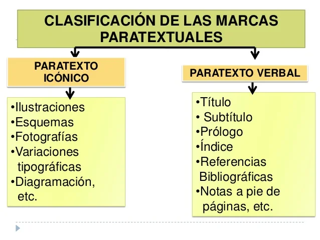

> Repaso de contenidos esenciales.

## Lectocomprensión en Lengua Extranjera

La lectocomprensión en un idioma extranjero supone:

-  La aplicación de estrategias de lectura y la transferencia de éstas de la lengua materna a la extranjera; esto sirve de eje conductor para la presente asignatura cuyas clases tendrán un carácter teórico-práctico y en las cuales los estudiantes como lectores serán actores centrales y protagonistas de su proceso de aprendizaje. 

-  La construcción de los conocimientos disciplinares a los que los estudiantes, como miembros de una comunidad disciplinar determinada, deben acceder

## Género Discursivo

Evento comunicativo que tiene propósitos identificados y definidos por los miembros de una comunidad académica o profesional determinada, quienes construyen sus géneros a partir de estructuras, funciones y contenidos particulares.

El conocimiento de los géneros discursivos ha contribuido en gran medida a comprender la manera en que el discurso es usado en contextos académicos.

## Estrategias de Lectura

> Son **procedimientos** de carácter elevado que implican la presencia de objetivos que cumplir, la planificación de las acciones que se desencadenan para lograrlos, así como su evaluación y su posible cambio.

1. **Prelectura**: Nos ayudan a generar las hipótesis de lectura y a activar los conocimientos previos relevantes.

2. **Durante la lectura**: Nos ayudan a realizar inferencias, a monitorear la propia comprensión mientras se lee y a tomar decisiones adecuadas ante imprecisiones en la comprensión.

3. **Poslectura:** Nos ayudan a sintetizar el contenido y a expandir el conocimiento que se ha logrado mediante la lectura.

### Caso Práctico: Skimming/Scanning

Skimming (del inglés skim, es decir, sobrevolar) y el scanning (de scan, escanear) son dos técnicas que buscan la aceleración de la lectura de textos, principalmente académicos, para ir directamente al grano. Su objetivo, pues, es común: no tener que completar la lectura del documento para extraer la información que nos interesa. Así pues, sus diferencias radican en la forma en que funcionan

* El **Skimming** consiste en leer solo los primeros párrafos y los últimos de cada página, es decir, la introducción y la conclusión. La idea es quedarse solo con los conceptos más importantes, que suelen concentrarse en estas partes, y evitar el resto: evidentemente, el skimming no te permitirá profundizar en el contenido, pero sí ir directamente al grano y saltarte las partes complementarias.

* El **Scanning** consiste en una exploración del texto, o sea, en buscar la información que necesitamos encontrar en el documento sin tener que leerlo completo gracias a una exploración visual: se trata de buscar con la mirada por encima del texto hasta que encontremos el término, palabra, concepto o idea que necesitamos releer. Para que esto funcione es muy importante que tengas clara la estructura del texto, ya que así sabrás a qué párrafos debes acudir y en qué parte debería estar lo que andas buscando.

## Elementos Paratextuales o Paratexto

A través de la observación de los elementos paratextuales podemos anticipar contenidos clave de un texto.

Estos elementos proporcionan información que potencian la comprensión porque a partir de los datos que se encuentran allí, se pueden establecer relaciones entre lo que el texto dice y algún otro conocimiento previo.

## Palabras Transparentes y Falsos Cognados

* **Palabras Transparentes:** comparten ortografía y significado con los equivalentes de nuestra lengua y son fácilmente transferibles de una lengua a otra.

* **Falsos Cognados:** comparten características morfológicas similares pero tienen significados diferentes. [Lista de falsos cognados](https://drive.google.com/file/d/1vmfz6ruW2jx0Z3Vl1qB2zHiVjAvuTZKO/view?usp=sharing)

---