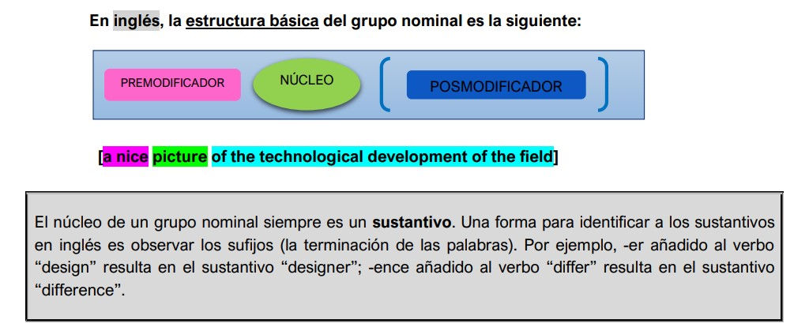
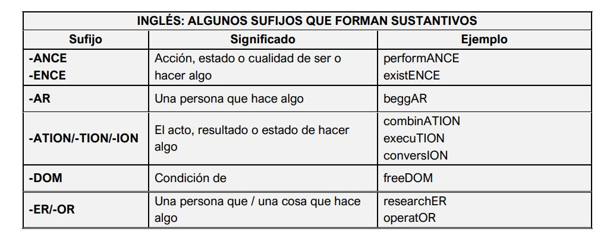
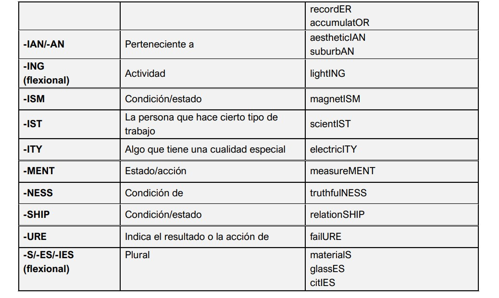

---

## Grupos Nominales

Observe el siguiente pasaje del texto “Two views of computing” y preste atención a las secciones resaltadas:

**• ¿Puede comprender el contenido principal?** 

**• Ahora observe nuevamente el mismo pasaje:**

**¿Puede comprender el contenido principal? ¿Por qué?** 

**Los fragmentos resaltados en la primera versión son _grupos nominales_. Los grupos nominales tienen la mayor carga informativa del texto. Si los “quitamos” se pierde información esencial.**

### ¿Qué es un grupo nominal o construcción nominal?

Los sustantivos funcionan como núcleo (N), o palabra principal, de una construcción. Las construcciones cuyo núcleo es un sustantivo reciben el nombre de construcciones sustantivas o grupos nominales. Una construcción es un conjunto de palabras en el que la palabra principal está acompañada por otras, subordinadas a ella. En el caso de las construcciones sustantivas, las palabras subordinadas sirven para limitar el significado del sustantivo núcleo, para ampliarlo, para indicar su número.

### ¿Por qué es importante conocer su estructura?

El grupo nominal “compacta”, “empaqueta” gran cantidad de información. La información ahí contenida debe ser “desempacada”, “decodificada” para lograr una comprensión acabada. El grupo nominal tiene una notable presencia en el discurso de las disciplinas proyectuales y su correcta decodificación contribuye al mejoramiento de la comprensión lectora.

## Derivación

La derivación consiste en el agregado de afijos al comienzo o al final de una palabra, de modo que se forma una palabra nueva. Conocer la raíz de una palabra y observar sus prefijos y/o sufijos permite deducir el significado sin recurrir necesariamente al diccionario. Conocer la derivación también permite diferenciar matices de significación.

