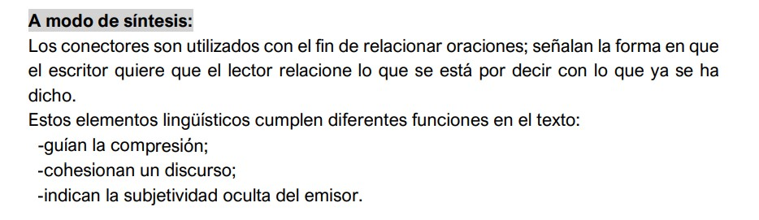

---

## Conectores

Son palabras que indican la relación que existe entre las ideas de un texto. Pueden localizarse al principio o en medio de la información.

También reciben el nombre de **Marcadores de discurso**.

### Importancia de los conectores

Entender el uso de los conectores ayuda en la lectura de textos de inglés y, reconociendo el tipo de relación que indican, se obtiene el significado de los enunciados difíciles, ya que si se entiende una parte del enunciado, el conector servirá para entender el resto.

Considerando su significado y el tipo de relación que manifiestan, los conectores se clasifican en:

* Temporales
* De Adición
* De Contraste
* De Condición
* De Causa / Razón
* De Consecuencia / Resultado
* De Ejemplificación

#### De causa / Razón

Indican una explicación de la información

`because`
`since`

#### De Consecuencia / Resultado

Muestran una consecuencia de lo ya mencionado.

`as a result`        `for that reason`
`consequently`     `in that case`
`so`                            `therefore`
`then`                        `thus`

#### Conector de ejemplificación

`for example`
`to illustrate this`
`by way of example`

 *Sensor are devices that can detect changes in the environment, **such as** temperature, humidity, light, motion, or pressure.*

Conector: *such as*
Relación lógica: *ejemplificación*
Equivalente en Español: *tales como*
Idea 1: *Sensor are devices that can detect changes in the environment*
Idea 2: *temperature, humidity, light, motion, or pressure.*

#### Conector de causa

`because`
`because of`
`due to`

*These devices are at the heart of IoT, **as** they allow machines and devices to interact with the physical world.*

Conector: *as*
Relación lógica: *causa*
Equivalente en Español: *ya que*
Idea 1: *These devices are at the heart of IoT*
Idea 2: *they allow machines and devices to interact with the physical world*

#### Conectar de contraste

`yet`
`in contrast`
`nonetheless`

*Generally, industrial internet of things (IIoT) is most abundant in manufacturing, transportation and utility organizations that use sensors and other IoT devices; **however**, it also has use cases automation industries, leading some organizations toward digital transformation*

Conector: *however*
Relación lógica: *contraste*
Equivalente en Español: *Sin embargo*

#### Conector de adición

`and`
`furthermore`
`besides`
`in addition`
`also`

*Sensors can collect data on rainfall, humidity, temperature and soil content and IoT can help automate farming techinques. **Additionally**, IoT devices can be used to oversee the health of livestock, monitor equipment and streamline supply chain management.

Conector: *Additionaly*
Relación lógica: *adición*
Equivalente en Español: *además*

#### Conector de consecuencia

`thus`
`therefore`
`hence`
`as a consequence / result`

Conector: `thus`
Relación lógica: `consecuencia`
Equivalente en Español: `Así / Por lo tanto`

#### Conector de contraste

* Although (Aunque)
* Even though (Incluso que / A pesar de)
* But (Pero)
* Yet (Aún)
* However, nevertheless (Sin embargo)
* Nonetheless (No obstante)
* Despite of, In spite of (A pesar de)
* Whereas, While (Mientras que)
* On the other hand (Por otro lado)

## Ejemplos de diferentes conectores

*They mentioned that although both the SSN services are efficient and reliable, however, ZigBee comparatively provides higher security but consumes high energy whereas TinySec consumes low energy but not as highly secured as ZigBee.*

Conector: *Although* (Aunque)
Idea 1:  mencionaron que 
Idea 2: ambos servicios SSN son eficientes y confiables, ZigBee comparativamente brinda mayor seguridad….
Aquí el contraste se establece entre dos servicios

*Some information remained missing which leads to not highly accurate analysis. Therefore, IoT based framework is able to solve this problem and can provide high accuracy in analysis and prediction.*  

Conector: *Therefore* (Por lo tanto)
Idea 1: Faltaba información, lo que provocaba un análisis poco preciso.
Idea 2: un marco basado en IoT puede resolver este problema y proporcionar alta precisión en el análisis y la predicción.

## Dato importante

**Ningún conector puede ser de causa y consecuencia al mismo tiempo, por lo tanto debemos decir que un conector establece una *relación de causa* o *una de consecuencia*, pero no de causa y consecuencia**.

